  

# Inventory Management Application
This Inventory Management Application is an assignment built for Dr. Hollander's Fall 2021
COP3330 course at the University of Central Florida.

## Documentation and Capabilities
This Inventory Management Application is capable of storing at least 1024 items, with each
item containing a name between 2 and 256 characters (inclusive), a monetary value,
and unique serial number in the format "A-XXX-XXX-XXX" where 'A' is any letter and 'X' any
letter or number.
  
### Item Components
Each item consists of 3 components:
* An item name between 2 and 256 characters (inclusive).
	* Item names can include any characters so long as they fit the character requirement.
* A monetary value that must be greater than or equal to $0.00.
	* In the case of this application, monetary values refers to the USD($).
	* Inputs and edits to monetary values are taken in a "0.00" format with no dollar sign necessary.
* A serial number which in the format "A-XXX-XXX-XXX" where 'A' is any letter and 'X' any letter or number.
	* In the case of this application, serial numbers are CASE SENSITIVE. This means that "A-111-111-111" is different than "a-111-111-111."

### Adding Items
To add an item to the inventory, navigate to the top left section of the application. There
will be a menu bar with a button that says "Options." Pressing the button displays a drop down
of more buttons to use. Select "Add Item", which will then change the left side of the screen
to display the "Add Items" functionality. Enter the information of the item into the labeled
text boxes (follow the aformentioned [item component restrictions](#item-components). Press "Add Item" and the item will display on the table in the center. Any errors will result in an error window advising you which input may be flawed.
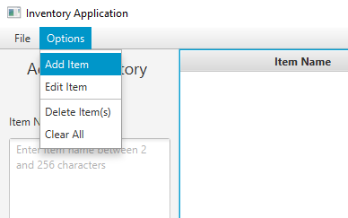
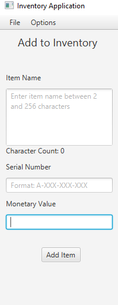

### Removing Items
To remove an item from the inventory, navigate to the top left section of the application. There
will be a menu bar with a button that says "Options". Pressing the button displays a drop down
of more buttons to use. Select "Delete Item(s)", which will then change the left side of the screen
to display instructional text and a "Delete" button. Simply select an item (or multiple by holding the CTRL key) and press the aforementioned button. Press the "Ok" button on the window that appears to confirm you want to delete those items.
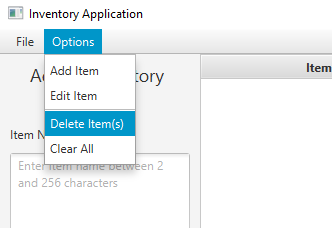
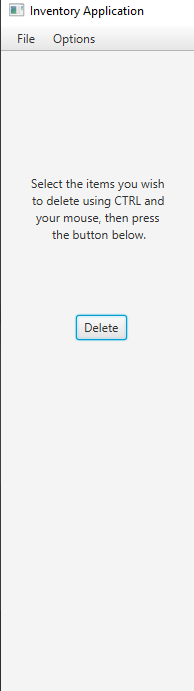

### Clearing All Items
To clear the inventory entirely, navigate to the top left section of the application. There
will be a menu bar with a button that says "Options". Pressing the button displays a drop down
of more buttons to use. Select "Clear All," which will open a confirmation window. Press the "Ok" button on the window that appears to confirm you want to clear the inventory.
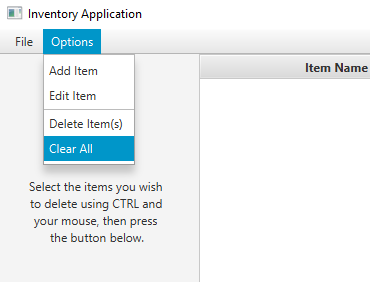
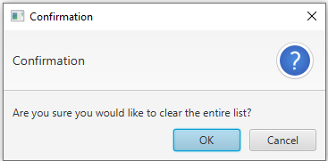

### Editing the Contents of an Item
To edit the contents of an item, navigate to the top left section of the application. There
will be a menu bar with a button that says "Options." Pressing the button displays a drop down
of more buttons to use. Select "Edit Item", which will then change the left side of the screen
to display the "Edit Current Item" functionality. Select the item which you would like to edit. Any boxes left blank will result in no changes to that component. Press "Save Edit" to complete the changes. Note that the [above restrictions](#item-components) still apply.
* To edit the item name, enter the new name into the "Item Name" textbox.
* To edit the serial number, enter the new serial number into the "Serial Number" textbox.
* To edit the value, enter the new value into the "Monetary Value" textbox.
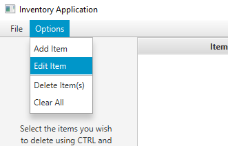
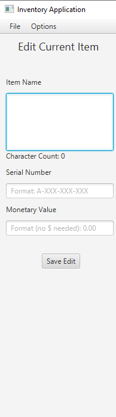

### Searching Items
To search for a specific item by name or serial number, navigate to the right side of the screen. Simply enter what you are searching for into the searchbox and the table will adjust to display all items with a serial number or item name matching the input.
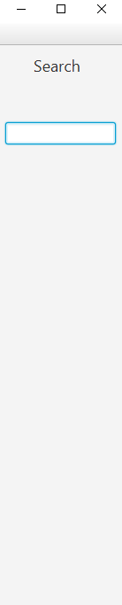

  
### Sorting Items
To sort by any of the three components, click on the corresponding header located at the top of the table for the appropriate component.  Click once to sort in descending order, twice to sort in ascending.
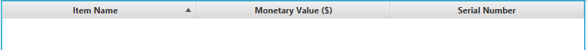
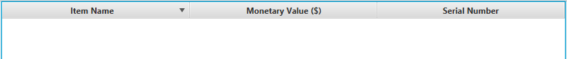

### Saving the Inventory to Your PC
This application comes with the ability to save and reopen inventories at a later date. In order
to save the current inventory, navigate to the top left section of the application. There will be a menu bar with a button that says "File." Select "Save As..." and a file window will pop up, allowing you to save an HTML, TSV, or JSON file.
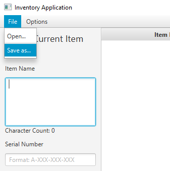
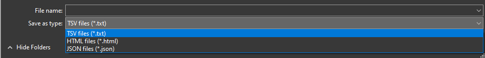

### Loading a Previously Saved Inventory from Your PC
This application comes with the ability to save and reopen inventories at a later date. In order
to reopen a previously saved inventory, navigate to the top left section of the application. There will be a menu bar with a button that says "File." Select "Open..." and a file window will pop up, allowing you to reopen an HTML, TSV, or JSON file from a previous session.
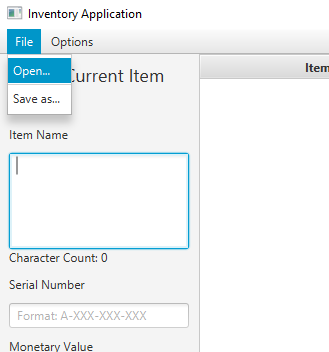
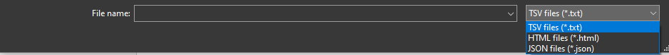

## Authors
- [Miguel Rosario](https://github.com/MRosario530)